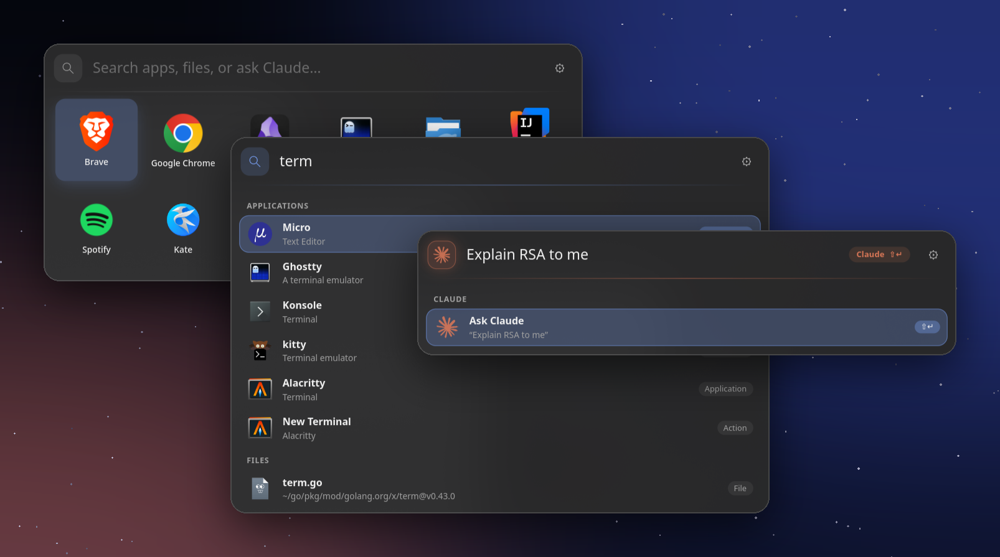
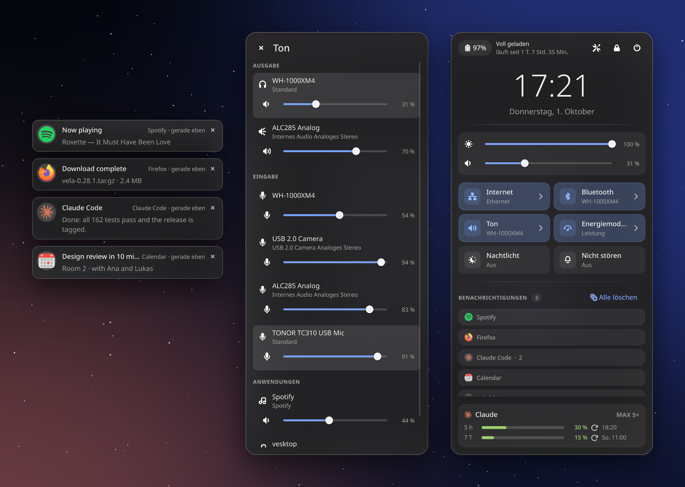
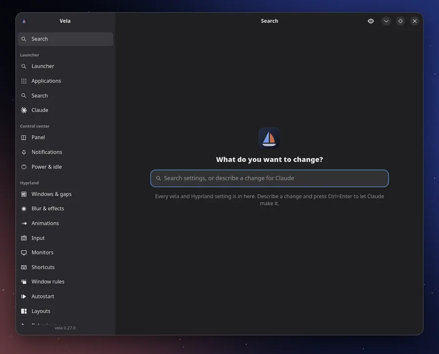
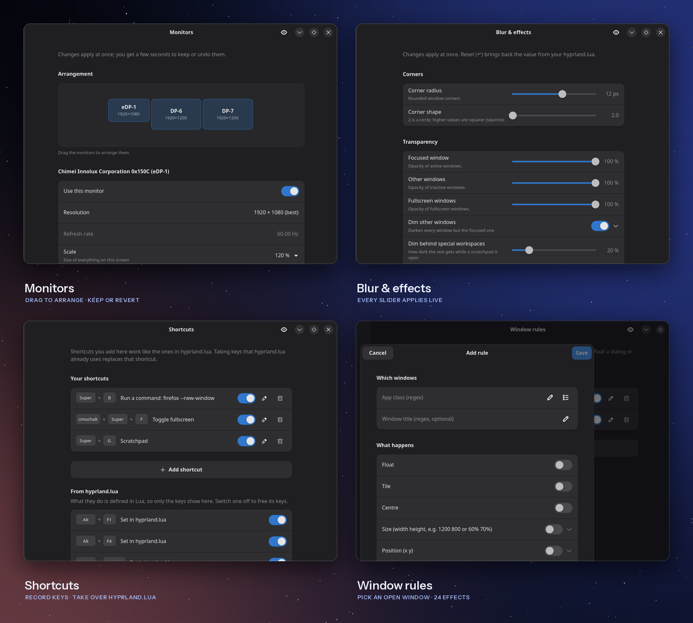
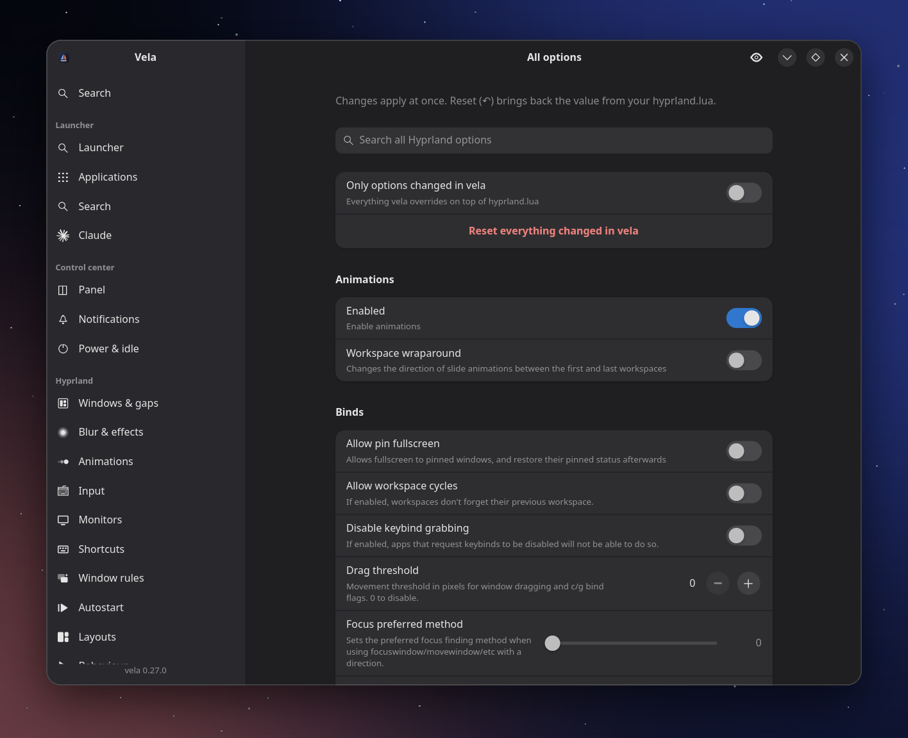
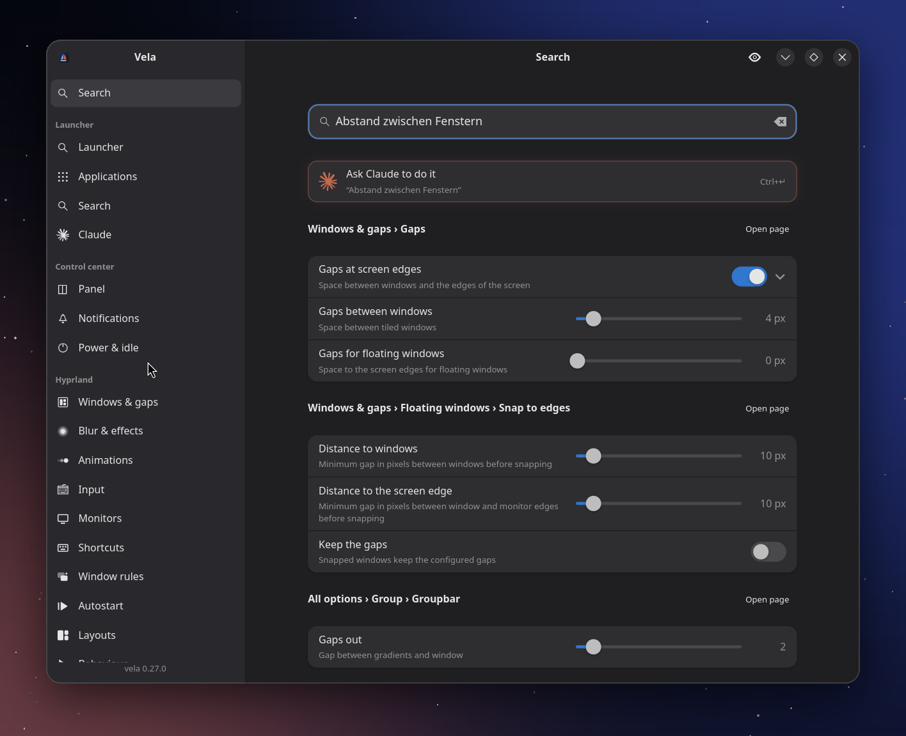
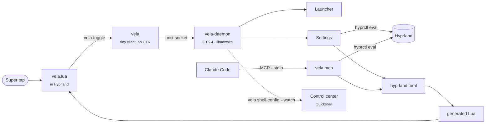

<p align="center">
  <a href="https://github.com/Raindancer118/vela/releases"></a>
  <a href="https://github.com/Raindancer118/vela/actions"></a>
  
  
  <a href="LICENSE"></a>
</p>

<p align="center">
  <b>Tap Super.</b> Find any app, any file, any setting.<br>
  Change Hyprland with sliders instead of a config file, or just tell Claude what you want.
</p>

<p align="center">
  <a href="#the-launcher">Launcher</a> &nbsp;·&nbsp;
  <a href="#the-control-center">Control center</a> &nbsp;·&nbsp;
  <a href="#hyprland-without-the-config-file">Hyprland settings</a> &nbsp;·&nbsp;
  <a href="#just-say-it">Claude</a> &nbsp;·&nbsp;
  <a href="#get-it">Install</a> &nbsp;·&nbsp;
  <a href="#under-the-hood">How it works</a>
</p>

<br>

<a id="the-launcher"></a>




<table>
<tr>
<td width="33%" valign="top">

**Tap, don't hold.**
A tap on <kbd>Super</kbd> opens it. <kbd>Super</kbd>+<kbd>Q</kbd>, <kbd>Super</kbd>+<kbd>1</kbd> and
every other shortcut keep working and never open it by accident, even
combinations that have no bind.

</td>
<td width="33%" valign="top">

**One field, everything.**
Fuzzy app search with desktop actions, a file search whose index covers
100 000 files in about 50 ms, and your pinned apps as a grid while the field
is empty.

</td>
<td width="33%" valign="top">

**Ask Claude.**
Type a question and <kbd>Shift</kbd>+<kbd>Enter</kbd> hands it to Claude Code in
your terminal, as a single argument, never through a shell.

</td>
</tr>
</table>

<details>
<summary><b>Keys</b></summary>

| Key | Action |
| --- | --- |
| type | search apps, files and Claude |
| <kbd>←</kbd><kbd>↑</kbd><kbd>↓</kbd><kbd>→</kbd> | move in the grid; <kbd>↑</kbd><kbd>↓</kbd> / <kbd>Tab</kbd> in results |
| <kbd>Enter</kbd> | open the selected entry |
| <kbd>Shift</kbd>+<kbd>Enter</kbd> | send the whole input to Claude Code |
| <kbd>Ctrl</kbd>+<kbd>Enter</kbd> | show the selected file in its folder |
| <kbd>←</kbd> / <kbd>→</kbd> | open the selected result on the monitor left / right of this one |
| <kbd>Ctrl</kbd>+<kbd>,</kbd> | settings |
| <kbd>Esc</kbd> | close |
| right-click | pin / unpin / move tiles |

While the input reads like a prompt ("Explain RSA to me", or anything ending
in `?`), or while <kbd>Shift</kbd> is held, the search icon turns into the Claude
logo: <kbd>Enter</kbd> goes to Claude.

</details>

<br>

<a id="the-control-center"></a>


`vela shell` runs a control center built on Quickshell, in exactly the look
of the launcher and the settings: the same font, the same Adwaita icons, the
same accent selection, sliders and boxed lists.



<table>
<tr>
<td width="50%" valign="top">

- **Quick settings**: Wi-Fi, Bluetooth, sound, power profile, night light, do not disturb; each tile opens its details
- **Notifications**: popups, groups per app, compact rows that unfold when the pointer rests on them
- **Power & idle**: dim, lock, screen off and sleep, each with its own switch and delay (runs hypridle for you)

</td>
<td width="50%" valign="top">

- **Claude usage**: 5-hour and weekly limits of every Claude Code profile, with the plan as Anthropic has it now and the reset time
- **Workspace dots** when you switch workspaces
- **Updates**: a tile with what is pending (repositories, AUR, Flatpak) that opens Settings → Updates
- **Screen-share picker** for xdg-desktop-portal-hyprland: screens as they stand on your desk, windows and a region, all with live previews
- **Tap or hold** a shortcut (`panel_peek`, e.g. <kbd>Super</kbd>+<kbd>T</kbd>): a tap keeps it open, holding shows it until you let go
- Speaks your language (German above)

</td>
</tr>
</table>

<br>

<a id="hyprland-without-the-config-file"></a>


The settings open on a single search field. Type what you are looking for, in
English or German, and the settings appear right below it, ready to use: no
need to find the page they live on.

<p align="center">
  
</p>

Every option Hyprland has is in there. The ones you change most have their own
pages with sliders, switches and colour pickers, and each change shows up on
screen the moment you make it.



<table>
<tr>
<td width="50%" valign="top">

**Windows & gaps** · gaps to the screen edges on or off per edge, their width, gaps between windows, border width and gradient colours, layout, snapping

**Blur & effects** · blurriness, passes, brightness, contrast, vibrancy, noise, rounded corners, transparency, dimming, shadow, glow

**Animations** · on or off, duration, curve (beziers and springs, plus a few of vela's own) and style, for each part: opening, closing, workspaces, fades, layers

**Input** · keyboard layout and repeat, mouse speed and acceleration, touchpad, workspace swipe, cursor hiding and zoom

</td>
<td width="50%" valign="top">

**Monitors** · drag them into place, resolution, refresh rate, only scales that give sharp pixels, rotation, VRR, on and off, with a 15-second *keep or revert*

**Shortcuts** · record keys and pick from 22 actions or any command; take over or switch off the shortcuts from your hyprland.lua

**Window rules** · pick an open window, then float it, size it, send it to a workspace, pin it, make it opaque … (24 effects)

**Autostart · Layouts · Behaviour · All options** · the rest, down to the last of Hyprland's ~350 options, searchable

</td>
</tr>
</table>

**Updates** · update everything (pacman/paru or yay, Flatpak), only refresh
the package database, or tick single apps; the output runs live below. When
something fails, **Fix with Claude** opens Claude Code with the error and the
log in a terminal on your minimized windows (`special:minimized`, no focus
stolen) and it repairs the update there; *Show* brings it over.

> [!TIP]
> Your `hyprland.lua` is never rewritten. vela keeps what you change in
> `~/.config/vela/hyprland.toml`, applies it live with `hyprctl eval`, and
> loads it at the end of your config. Only what you touched is overridden;
> the ↶ next to a setting gives you your own value back.

<details>
<summary><b>All options, searchable</b></summary>
<br>

</details>

<br>

<a id="just-say-it"></a>


<table>
<tr>
<td width="55%" valign="middle">

</td>
<td width="45%" valign="middle">

Write what you want instead of looking for it:

> *Make the gaps between windows smaller and the blur a bit stronger.*

> *Float pavucontrol, centred, 900 by 600.*

> *Super+B should open Firefox.*

Press <kbd>Ctrl</kbd>+<kbd>Enter</kbd> and Claude Code does it through
**`vela mcp`**, vela's own MCP server. Every change goes the same way as from
the settings window: live, kept, and one click away from undone.

</td>
</tr>
</table>

<details>
<summary><b>The MCP tools</b></summary>

`install.sh` registers the server with Claude Code
(`claude mcp add --scope user vela -- vela mcp`), in the default profile and
in every ccacct profile (`~/.claude-accounts/*`).

| Tool | What it does |
| --- | --- |
| `search_hyprland_options` | find options by words in name or description, with value, default, range and choices |
| `set_hyprland_options` | set several options at once (numbers, colours, gradients, gaps, choices by name) |
| `reset_hyprland_options` | give options, animations or monitors back to hyprland.lua |
| `list_hyprland_animations` · `set_hyprland_animation` | what each animation does, and change it |
| `list_monitors` · `set_monitor` | modes, valid scales, position, rotation, VRR |
| `list_shortcuts` · `set_shortcut` · `remove_shortcut` | vela's shortcuts and the keys hyprland.lua uses |
| `list_window_rules` · `set_window_rule` · `remove_window_rule` | rules, their effects and the windows open now |
| `set_autostart` | commands started with Hyprland |
| `get_vela_settings` · `set_vela_setting` · `open_vela_settings` | vela itself |

</details>

<br>

<a id="get-it"></a>


On Arch Linux, with Hyprland 0.55 or newer (Lua config):

```sh
sudo pacman -S --needed gtk4 gtk4-layer-shell libadwaita rust   # plocate, quickshell: optional
git clone https://github.com/Raindancer118/vela && cd vela && ./install.sh --hyprland
```

That's all: tap <kbd>Super</kbd>. Everything lands in your home directory, and
`--hyprland` adds one line to the end of `~/.config/hypr/hyprland.lua` (after a
backup):

```lua
dofile(os.getenv("HOME") .. "/.config/hypr/vela.lua").setup()
```

<details>
<summary><b>Pick what you want: profiles and components</b></summary>

`install.sh` asks which profile to install, or lets you pick the parts one by
one. Running it again changes the selection; parts you drop are removed again
(settings stay). Settings and Appearance are always there.

| Profile | Contains |
| --- | --- |
| `full` | everything (default) |
| `minimal` | the launcher |
| `launcher` | launcher, Claude Code, Hyprland settings, updates |
| `panel` | control center, idle, screen-share picker, updates (no launcher) |

Components: `launcher`, `claude`, `hyprland`, `panel`, `idle`,
`share-picker`, `updates` (`./install.sh --list` describes them).

```sh
./install.sh --profile panel -y                          # no questions
./install.sh --profile launcher --without claude --with idle
./install.sh -y                                          # update, keep the selection
```

The selection lives in `~/.local/share/vela/components.toml`; vela and
`vela.lua` leave out what isn't installed (`vela components` shows it, so
does *Settings → System*). Without that file, as with the package, everything
is on.

</details>

<details>
<summary><b>What gets installed where</b></summary>

| File | Location |
| --- | --- |
| `vela`, `vela-daemon`, `vela-share-picker` | `~/.local/bin/` |
| systemd user unit | `~/.config/systemd/user/vela.service` |
| Hyprland module | `~/.config/hypr/vela.lua` |
| control center (QML) | `~/.local/share/vela/shell` |
| component selection | `~/.local/share/vela/components.toml` |
| desktop entry, icons | `~/.local/share/applications`, `~/.local/share/icons` |
| MCP server | registered with Claude Code, if installed |

Claude Code must be installed for the Claude features (`claude` in `PATH`, or
set its path under *Settings → Claude*).

**As a package**: `pkg/arch/PKGBUILD` builds a system package (binaries in
`/usr/bin`, the module in `/usr/share/vela/hyprland/vela.lua`):
`cd pkg/arch && makepkg -si`, then load
`dofile("/usr/share/vela/hyprland/vela.lua").setup()`.

**Uninstall**: `./uninstall.sh` (keeps `~/.config/vela`) or
`./uninstall.sh --purge`. It removes the `dofile` line too, after a backup.

</details>

<details>
<summary><b>What <code>setup()</code> does, and its options</b></summary>

1. **Super tap.** It listens to `input.keyboard.key`, which Hyprland emits for
   every key before binds run. Super arms the launcher; any other key while
   Super is down disarms it, as does holding it longer than `tap_ms`. Releasing
   an armed Super runs `vela toggle`.
2. **Layer rules**: blur behind the launcher, its backdrop and the control
   center; Hyprland's own layer animation off (vela animates itself).
3. **Autostart** of the daemon (`vela.service`, or the daemon directly).
4. **Control center**: `vela shell` (`shell = false` to skip). Don't also start
   `qs` yourself: two notification daemons would fight.
5. **Idle**: `vela idle` runs hypridle with the *Power & idle* settings
   (`idle = false` to skip). Don't also start hypridle yourself.
6. **Hyprland settings** made in vela (`settings = false` to skip). They
   override hyprland.lua, so call `setup()` at its **end**.

```lua
dofile(os.getenv("HOME") .. "/.config/hypr/vela.lua").setup({
    tap_ms    = 400,          -- max. duration of a tap
    keycodes  = { 133, 134 }, -- Super_L, Super_R (XKB keycodes)
    blur      = true,
    autostart = true,
    shell     = true,         -- start the control center
    idle      = true,         -- run hypridle with vela's settings
    settings  = true,         -- apply the Hyprland settings made in vela
    panel_peek = nil,         -- e.g. "SUPER + T": tap toggles the control center,
                              -- holding shows it until you let go (peek_ms = 280)
    binary    = nil,          -- path to `vela`, found automatically
})
```

Still on `hyprland.conf`? A release bind (`bindr = SUPER, SUPER_L, exec, vela toggle`)
plus a blur `layerrule` for the namespace `vela` comes closest, but can't
tell combinations without a bind apart and isn't tested. The Hyprland settings
need the Lua config.

</details>

<br>

<a id="under-the-hood"></a>




<details>
<summary><b>How it works, in detail</b></summary>

- **`vela`** is a small client without GTK. It sends one line (`toggle`,
  `show`, …) to `$XDG_RUNTIME_DIR/vela.sock` and answers in about a millisecond.
- **`vela-daemon`** runs the GTK application: the launcher is a layer-shell
  overlay on the focused (or main) monitor, the settings a libadwaita window
  in the same process, which is why changes apply instantly.
- **Applications** come from the XDG `applications` directories, following the
  Desktop Entry Specification (`NoDisplay`, `Hidden`, `OnlyShowIn`, `TryExec`,
  `Terminal`, localized keys). `Exec` is split into arguments by the spec and
  started directly, never through a shell, in its own systemd scope.
- **Search** runs on worker threads: nucleo fuzzy matching weighted towards
  exact and prefix matches plus a launch history; file search debounced, a
  newer query cancels the running one.
- **File index**: per search root vela checks whether the plocate database
  covers it, else it builds its own in-memory index (a parallel walk on the
  same file system, ~50 ms for 100 000 files).
- **Hyprland settings**: the option catalogue comes from Hyprland itself
  (`j/descriptions`, `j/getoption`), so new Hyprland options show up without a
  vela update. Changes go out with `hyprctl eval` and into
  `~/.config/vela/hyprland.toml`; the Lua generated from it
  (`~/.local/state/vela/hyprland.lua`) wraps every entry in `pcall`, so one
  option an older Hyprland doesn't know can't break your config.
- **Shortcut recording** briefly enters an empty Hyprland submap, so the keys
  you press reach vela instead of their bind.
- **Settings search** borrows the real rows from their pages and puts them
  back afterwards: what you find is the setting itself, not a copy.
- **Control center**: `vela shell` runs Quickshell on the QML in `shell/`. It
  reads the settings through `vela shell-config --watch` (one JSON line per
  change). The QML started as the Quickshell config of
  [Luna1506/nixos](https://github.com/Luna1506/nixos).
- **Screen sharing**: `install.sh` sets `custom_picker_binary =
  …/vela-share-picker` in `~/.config/hypr/xdph.conf` (if no other picker is
  set) and restarts the portal. It runs `shell/share-picker.qml` as its own
  Quickshell instance and answers xdph on stdout; regions are drawn with slurp.

</details>

<details>
<summary><b>Configuration reference</b> (<code>~/.config/vela/config.toml</code>)</summary>

Use the settings window: `vela settings`, the gear in the launcher, or
<kbd>Ctrl</kbd>+<kbd>,</kbd>. You can also edit the file by hand; vela notices and
reloads it, reports errors in the settings and keeps the last valid settings
(an unparsable file is backed up as `config.toml.broken-<time>`).
`data/config.example.toml` lists every option with its default.

| Section | Key | Meaning |
| --- | --- | --- |
| `general` | `width`, `max_height` | size of the launcher (logical px); content scrolls beyond `max_height` |
| | `vertical_position` | distance from the top of the monitor in % |
| | `opacity` | background opacity 0–1 |
| | `close_on_focus_loss` | hide on a click outside the panel |
| | `main_monitor` | always open here while connected: `"desc:<make model serial>"` or a connector like `"DP-7"`; empty = focused monitor |
| | `max_results` | rows in the result list |
| | `systemd_scope` | start apps in their own transient scope |
| `appearance` | `theme` | `dark`, `midnight`, `graphite`, `nord`, `light` |
| | `accent` | `#rrggbb` |
| | `tile_size`, `icon_size`, `spacing`, `border_radius`, `surface_opacity`, `font_scale` | |
| | `columns` | fixed column count, `0` = derived from width |
| | `show_labels`, `tile_background`, `tile_outline` | the app grid |
| | `animations`, `animation_speed` | motion on/off; speed factor |
| | `backdrop`, `backdrop_dim`, `backdrop_blur` | blur and darken the rest of the monitor while the launcher is open (`backdrop_blur = false`: only darken) |
| `apps` | `grid` | `pinned`, `pinned_then_all`, `all` |
| | `pinned`, `hidden` | desktop IDs (`firefox.desktop`), `custom:<id>` or `vela:settings` |
| | `desktop_actions` | offer desktop actions in search |
| | `[[apps.custom]]` | `id`, `name`, `command` (argv array), `icon`, `terminal`, `keywords` |
| `search` | `apps`, `files`, `claude` | result sources |
| | `max_app_results`, `max_file_results`, `min_file_query_len`, `debounce_ms`, `index_interval_minutes` | |
| | `file_backend` | `auto`, `plocate`, `builtin` |
| | `file_roots`, `exclude`, `include_hidden`, `include_directories` | what the file search covers |
| `claude` | `executable`, `args`, `working_dir` | runs `<terminal> <exec args> <executable> <args> -- "<prompt>"` |
| | `always_visible`, `shift_enter`, `prefer_for_questions` | when "Ask Claude" shows and wins |
| `panel` | `width`, `close_on_focus_loss`, `backdrop`, `backdrop_blur` | the control center |
| | `popup_timeout_secs`, `popup_max_visible`, `critical_popups_stay`, `group_collapsed_count`, `compact_notifications` | notifications |
| | `workspace_osd`, `night_light_temperature`, `clock_centered` | |
| | `clock_on_backdrop`, `clock_font` | clock large on the blurred backdrop (needs `backdrop` + `backdrop_blur`); clock font, empty = UI font |
| | `claude_usage`, `claude_usage_subtle`, `claude_usage_only_default`, `claude_usage_hidden` | Claude plan usage at the bottom of the panel |
| `idle` | `dim`, `lock`, `screen_off`, `suspend` (+ `*_after_min`), `lock_before_sleep` | what `vela idle` runs hypridle with |
| `updates` | `check_interval_hours` (0 = never), `aur`, `flatpak` | background checks and sources |
| | `claude_workspace` | where "Fix with Claude" opens, silently; empty = a normal window |
| | `panel.updates_tile` | the tile in the control center |
| `terminal` | `executable`, `exec_args` | default `kitty`; arguments before the command |

From scripts: `vela set idle.suspend false` (checked against type and range).
The Hyprland side lives in `~/.config/vela/hyprland.toml` (`[options]`,
`[animations.<leaf>]`, `[monitors."desc:…"]`, `[[shortcuts]]`, `unbind`,
`[[rules]]`, `[[autostart]]`), also editable by hand.

</details>

<details>
<summary><b>Command line</b></summary>

```
vela                      toggle the launcher (starts the daemon if needed)
vela show | hide
vela settings [page]      home, general, apps, search, claude, panel, notifications, power,
                          hypr-windows, hypr-effects, hypr-animations, hypr-input, hypr-monitors,
                          hypr-shortcuts, hypr-rules, hypr-autostart, hypr-layouts,
                          hypr-behaviour, hypr-all, appearance, updates, system
vela set <section.key> <value>
vela reload               re-read config, apps and file index
vela shell | panel [toggle|open|close] | idle
vela updates [list|check|watch]   pending updates as JSON | let the daemon look now | state for the panel
vela mcp                  MCP server for Claude Code (stdio)
vela quit | status | default-config
```

</details>

<details>
<summary><b>Troubleshooting</b></summary>

**Tapping Super does nothing.** Run `vela` in a terminal: if the launcher
appears, the Hyprland side is the problem. Check `hyprctl configerrors`, and
that the `dofile` line comes last. If your keyboard sends other keycodes for
Super, find them with `wev` and set `keycodes`.

**A Hyprland setting doesn't stick after a restart.** `setup()` must be the
last line of hyprland.lua (later lines would override vela), and
`settings = false` must not be set.

**No blur.** Blur needs `decoration.blur.enabled` (Settings → Blur & effects)
and the layer rules from `vela.lua`.

**Files in my home folder are not found with plocate.** On btrfs, `/home` is a
subvolume that updatedb skips. `file_backend = "auto"` notices and uses the
built-in index; or set `PRUNE_BIND_MOUNTS = "no"` in `/etc/updatedb.conf` and
run `sudo updatedb`.

**"Claude executable … was not found".** vela adds `~/.local/bin`,
`~/.cargo/bin` and `~/bin` to PATH; elsewhere, set the full path under
*Settings → Claude*.

**Wrong terminal.** *Settings → General → Terminal*. For unknown terminals,
turn off "Default arguments" and enter the flag that runs a command (usually
`-e`).

**Testing in a nested Hyprland.** Pass `autostart = false` to `setup()` there,
or D-Bus activated apps of your real session open in the nested one.

**Logs.** `journalctl --user -u vela -f`, or run `vela-daemon` in a terminal
(`RUST_LOG=vela=debug`).

</details>

<details>
<summary><b>Development</b></summary>

```sh
cargo test                                  # unit and integration tests
cargo test --lib live_ -- --ignored         # against the running Hyprland (no-op changes)
cargo clippy --all-targets -- -D warnings
cargo fmt --check
scripts/smoke-test.sh                       # start-up test on a Wayland display
scripts/shell-test.sh                       # control center (needs qs)
```

The README artwork is generated: `scripts/readme-art.py` (hero and headings,
text set with HarfBuzz and stored as outlines), `scripts/readme-shots.sh`
(screenshots from a throwaway vela that never takes the focus) and
`scripts/readme-frame.py` (frames, gallery, the search demo).

Releases: `git tag X.Y.Z && git push origin X.Y.Z`; GitHub Actions builds and
publishes them.

</details>

<br>

<p align="center">
  <br>
  <sub><i>vela</i> — Latin for <i>sails</i>, and the constellation of the sails of the ship Argo.<br>
  MIT licensed · made for Hyprland</sub>
</p>
