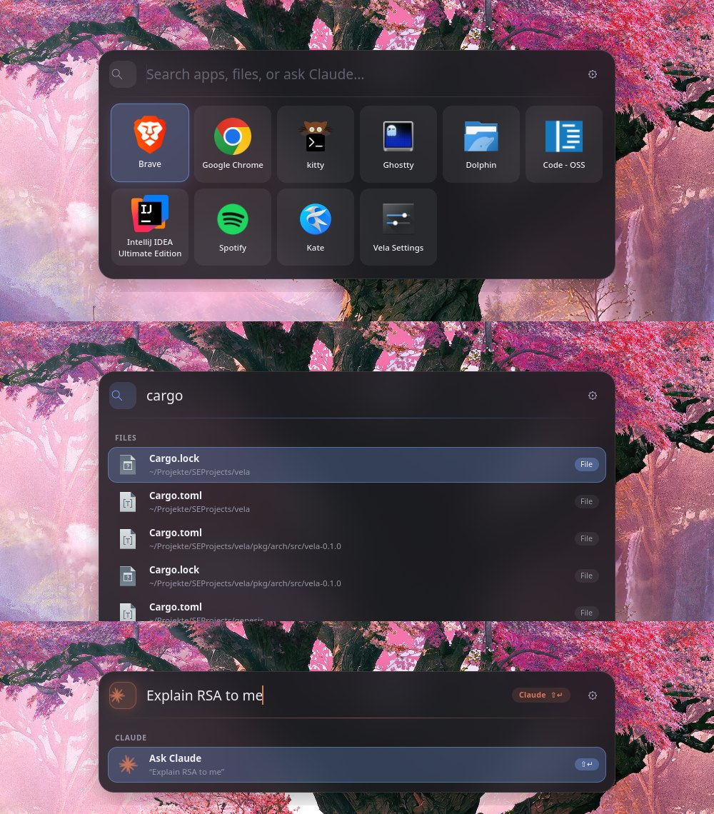

# vela

A fast, Spotlight-style application launcher for **Hyprland**, with file search
and **Claude Code** built in. Written in Rust with GTK 4, libadwaita and
gtk4-layer-shell.

- **Tap Super** to open it. Super+Q, Super+1 and every other shortcut keep
  working and never open the launcher by accident.
- **App grid** when the search is empty: your pinned apps, as many as you like,
  in a responsive grid that scrolls when it gets tall.
- **Unified search** as you type: fuzzy app search (with desktop actions such as
  "New Private Window"), indexed file search, and an **Ask Claude** entry.
- **Shift+Enter** sends the whole input to Claude Code in your terminal. The
  prompt is passed as a single argument, never through a shell.
- **Graphical settings** with live preview: every change applies immediately
  and is saved to `~/.config/vela/config.toml`.
- **Instant**: a background daemon keeps everything warm; `vela toggle` answers
  in about a millisecond.
- **Control center** (`vela shell`, built on Quickshell): quick settings, sound,
  Wi-Fi, Bluetooth, notifications with popups, night light and a workspace
  indicator. It uses the same theme, colours and motion settings as the launcher.



## Installation (Arch Linux)

Dependencies:

```sh
sudo pacman -S --needed gtk4 gtk4-layer-shell libadwaita rust
# optional
sudo pacman -S --needed plocate kitty xdg-utils
```

Claude Code must be installed for the Claude action (`claude` in `PATH`, or
configure its path in the settings).

### User install (recommended)

```sh
git clone https://github.com/Raindancer118/vela && cd vela
./install.sh --hyprland
```

This builds a release binary and installs, all under your home directory:

| File | Location |
| --- | --- |
| `vela`, `vela-daemon` | `~/.local/bin/` |
| systemd user unit | `~/.config/systemd/user/vela.service` |
| Hyprland module | `~/.config/hypr/vela.lua` |
| desktop entry, icons | `~/.local/share/applications`, `~/.local/share/icons` |

With `--hyprland` the script also appends one line to
`~/.config/hypr/hyprland.lua` (after making a backup). Without it, the script
prints the line so you can add it yourself.

### Package

`pkg/arch/PKGBUILD` builds a system package (binaries in `/usr/bin`, the
Hyprland module in `/usr/share/vela/hyprland/vela.lua`):

```sh
cd pkg/arch && makepkg -si
```

With the package, load the module from its system path:
`dofile("/usr/share/vela/hyprland/vela.lua").setup()`.

## Hyprland

Hyprland ≥ 0.55 uses a Lua configuration. Add this to
`~/.config/hypr/hyprland.lua`:

```lua
dofile(os.getenv("HOME") .. "/.config/hypr/vela.lua").setup()
```

`setup()` does three things:

1. **Super tap detection.** It uses the `input.keyboard.key` event, which Hyprland
   emits for every key before binds are processed. Pressing Super arms the
   launcher; any other key pressed while Super is held disarms it, as does
   holding Super longer than `tap_ms`. Releasing an armed Super runs
   `vela toggle`. This also covers combinations without a bind, which a plain
   release bind can't.
2. **Layer rule** for the `vela` namespace: blur behind the launcher, with
   `ignore_alpha` set so the soft shadow isn't blurred. Hyprland's own layer
   animation is off because vela animates itself. A second rule blurs the
   `vela-backdrop` layer: the optional blurred, dimmed screen behind the
   launcher (Settings → Appearance → Blur).
3. **Autostart** of the daemon on `hyprland.start`. It imports the session
   environment into systemd and restarts `vela.service`, falling back to
   starting the daemon directly.
4. **Control center**: starts `vela shell` on `hyprland.start` (`shell = false`
   to skip) and blurs the `quickshell-panel`, `quickshell-notifications`,
   `quickshell-osd` and `vela-shell-backdrop` layers. Don't also start `qs`
   yourself; two notification daemons would fight.
5. **Idle**: starts `vela idle` (`idle = false` to skip), which runs hypridle
   with a config generated from `[idle]` and restarts it when that changes.
   Don't also start hypridle yourself.
6. **Hyprland settings** made in vela (Settings → Hyprland: gaps, borders,
   blur, shadows, …; `settings = false` to skip). vela applies a change live
   with `hyprctl eval` and keeps it in `~/.config/vela/hyprland.toml`;
   `setup()` loads the Lua generated from it
   (`~/.local/state/vela/hyprland.lua`), so call it at the **end** of
   hyprland.lua. Only options changed in vela are overridden; ↶ next to an
   option drops the override and reloads the config.

Options (all optional):

```lua
dofile(os.getenv("HOME") .. "/.config/hypr/vela.lua").setup({
    tap_ms    = 400,          -- max. duration of a tap
    keycodes  = { 133, 134 }, -- Super_L, Super_R (XKB keycodes)
    blur      = true,
    autostart = true,
    shell     = true,         -- start the control center
    settings  = true,         -- apply the Hyprland settings made in vela
    binary    = nil,          -- path to `vela`, found automatically
})
```

The control center opens with the global shortcut `quickshell:panelToggle`,
e.g. `hl.bind("SUPER + SPACE", hl.dsp.global("quickshell:panelToggle"))`, or
with `vela panel [toggle|open|close]`.

Still on a Hyprland version with `hyprland.conf`? The closest equivalent is a
release bind, `bindr = SUPER, SUPER_L, exec, vela toggle`, plus a `layerrule`
that enables blur for the namespace `vela` (check the wiki of your version for
the exact syntax). A release bind can't detect combinations that have no bind,
and it isn't tested with vela. Only the Lua module above is.

### Hyprland settings and Claude

The settings open on a search: every vela and Hyprland setting can be found
and changed right there. Describe a change instead (“smaller gaps between
windows”) and press **Ctrl+Enter**: Claude Code starts with that request and
makes it through `vela mcp`, an MCP server with tools to search and set
Hyprland options, animations, monitors and vela's own settings. `install.sh`
registers it (`claude mcp add --scope user vela -- vela mcp`).

## Usage

| Key | Action |
| --- | --- |
| type | search apps, files and Claude |
| ←↑↓→ | move in the grid; ↑↓ / Tab in results |
| Enter | open the selected entry |
| Shift+Enter | send the whole input to Claude Code |
| Ctrl+Enter | show the selected file in its folder |
| ← / → | open the selected result on the monitor left / right of this one (in the result list, when there is one) |
| Ctrl+, | settings |
| Esc | close |
| right-click | pin / unpin / move tiles |

While the input reads like a prompt ("Explain RSA to me", or anything ending in
`?`), or while Shift is held, the search icon turns into the Claude logo to show
that Enter goes to Claude.

Command line:

```
vela               toggle (starts the daemon if needed)
vela show | hide
vela settings [general|appearance|apps|search|claude]
vela reload        re-read config, apps and file index
vela quit | status
vela default-config
```

## Configuration

Use the settings window: `vela settings`, the gear in the launcher, or Ctrl+,.
Changes apply immediately. The eye button in the header shows a live preview of
the launcher. **Restore defaults** is under *General*.

Settings are stored in `~/.config/vela/config.toml`. You can also edit this file
by hand; vela notices the change and reloads it. An invalid file is reported in
the settings window, and vela keeps using the last valid settings. Before
overwriting an unparsable file, vela backs it up as `config.toml.broken-<time>`.
`data/config.example.toml` contains every option with its default value.

| Section | Key | Meaning |
| --- | --- | --- |
| `general` | `width`, `max_height` | size of the launcher (logical px); content scrolls beyond `max_height` |
| | `vertical_position` | distance from the top of the monitor in % |
| | `opacity` | background opacity 0–1 |
| | `close_on_focus_loss` | hide on a click outside the panel (keeps the keyboard while open) |
| | `main_monitor` | always open on this monitor while connected: `"desc:<make model serial>"` or a connector like `"DP-7"`; empty = focused monitor |
| | `max_results` | rows in the result list |
| | `systemd_scope` | start apps in their own transient scope (`systemd-run --user --scope`) |
| `appearance` | `theme` | `dark`, `midnight`, `graphite`, `nord`, `light` |
| | `accent` | `#rrggbb` |
| | `tile_size`, `icon_size`, `spacing`, `border_radius`, `surface_opacity`, `font_scale` | |
| | `columns` | fixed column count, `0` = derived from width |
| | `show_labels` | app names under the icons |
| | `tile_background`, `tile_outline` | surface behind each grid tile; accent ring around the selected one |
| | `animations`, `animation_speed` | motion on/off; speed factor (2 = twice as fast) |
| | `backdrop`, `backdrop_dim` | blur everything else on the launcher's monitor while it is open; darkening 0–0.8 (blur strength = Hyprland's `decoration.blur`) |
| `apps` | `grid` | `pinned`, `pinned_then_all`, `all` |
| | `pinned` | desktop IDs (`firefox.desktop`), `custom:<id>` or `vela:settings`, in order |
| | `hidden` | desktop IDs never shown |
| | `desktop_actions` | offer desktop actions in search |
| | `[[apps.custom]]` | `id`, `name`, `command` (argv array), `icon`, `terminal`, `keywords` |
| `search` | `apps`, `files`, `claude` | enable the result sources |
| | `max_app_results`, `max_file_results` | |
| | `file_backend` | `auto`, `plocate`, `builtin` |
| | `file_roots` | folders to search (default `~`) |
| | `exclude` | folder names to skip (`node_modules`, `.git`, …) |
| | `include_hidden`, `include_directories` | |
| | `min_file_query_len`, `debounce_ms`, `index_interval_minutes` | |
| `claude` | `executable`, `args`, `working_dir` | what runs: `<terminal> <exec args> <executable> <args> -- "<prompt>"` |
| | `always_visible` | show "Ask Claude" even when other results exist |
| | `shift_enter` | Shift+Enter sends the input to Claude |
| | `prefer_for_questions` | put "Ask Claude" first for question-like input |
| `panel` | `width` | width of the control center (logical px) |
| | `close_on_focus_loss` | close it on a click elsewhere or when another surface takes the keyboard |
| | `backdrop` | blur everything else on its monitor while open (own switch; dimming = `appearance.backdrop_dim`) |
| | `popup_timeout_secs`, `popup_max_visible`, `critical_popups_stay` | notification popups |
| | `group_collapsed_count` | notifications per app before “Show more” |
| | `compact_notifications` | one small row per app in the panel; expands on click or when the pointer rests on it (popups stay full size) |
| | `workspace_osd` | workspace dots when switching workspaces |
| | `night_light_temperature` | Kelvin (hyprsunset) |
| | `clock_centered` | clock and date in the middle of the panel |
| | `claude_usage`, `claude_usage_subtle`, `claude_usage_only_default`, `claude_usage_hidden` | Claude plan usage (5 h / 7 d, plan) at the bottom of the panel; only `~/.claude`; profile names to leave out (`default`, ccacct names) |
| `idle` | `dim`, `lock`, `screen_off`, `suspend` | switch each step on or off (`suspend = false`: never sleep on its own); `vela idle` runs hypridle with them |
| | `dim_after_min`, `lock_after_min`, `screen_off_after_min`, `suspend_after_min` | minutes without input |
| | `lock_before_sleep` | lock the session before suspend |
| `terminal` | `executable` | default `kitty` |
| | `exec_args` | arguments before the command; omit to use the known default (`-e` for most, none for kitty/foot, `start --` for wezterm) |

Single settings can also be changed from scripts: `vela set idle.suspend false`
(the value is checked against the setting's type and range).

The control center takes `theme`, `accent`, `border_radius`, `surface_opacity`,
`font_scale`, `animations`, `animation_speed`, `backdrop_dim` and
`general.opacity` from the same file.

## How it works

- **Control center**: `vela shell` runs Quickshell on the QML in `shell/`
  (installed to `/usr/share/vela/shell`, override with `VELA_SHELL_DIR`). The
  shell doesn't parse TOML: it runs `vela shell-config --watch`, which prints
  the sanitized settings plus a palette derived from the theme as one JSON
  line per change. Claude usage comes from `vela claude-usage`: it reads each
  Claude Code profile's OAuth token, hands it to curl on stdin only and asks
  the unofficial endpoint behind Claude Code's `/usage` (may change any time).
  The QML started as the Quickshell config of
  [Luna1506/nixos](https://github.com/Luna1506/nixos).

- **`vela`** is a small client without GTK. It sends one line (`toggle`, `show`,
  …) to `$XDG_RUNTIME_DIR/vela.sock`.
- **`vela-daemon`** runs the GTK application. The launcher is a layer-shell
  overlay (`namespace = vela`, keyboard mode *on-demand*) placed on the focused
  monitor, which vela asks Hyprland for over its IPC socket. The settings window
  is a regular libadwaita window in the same process, which is why changes
  apply instantly.
- **Applications** come from the XDG `applications` directories. Desktop IDs,
  precedence and localized keys follow the Desktop Entry Specification, and
  `NoDisplay`, `Hidden`, `OnlyShowIn`/`NotShowIn`, `TryExec` and `Terminal` are
  honoured. The `Exec` value is split into arguments according to the spec and
  started directly, never through a shell. The list is rescanned automatically
  when packages change.
- **Search** runs on worker threads. App search uses nucleo fuzzy matching,
  weighted towards exact, prefix and word-prefix matches in the name, plus a
  launch history (frecency). File search is debounced, and a newer query cancels
  a running one.
- **File index:** with `auto`, vela checks for each search root whether the
  plocate database covers it. Roots that aren't covered use a built-in
  in-memory index. It is built by a parallel walk that stays on the same file
  system, is refreshed periodically and whenever the launcher opens, and takes
  about 50 ms for 100k files. Words shorter than 3 characters are never sent to
  plocate, because they force a scan of the whole database (seconds on large
  systems).

## Troubleshooting

**Tapping Super does nothing.** Run `vela` in a terminal: if the launcher
appears, the Hyprland side is the problem. Check `hyprctl configerrors`, and
check that the `dofile` line comes after anything that might unbind keys. If
your keyboard sends other keycodes for Super, find them with `wev` and set
`keycodes`.

**The launcher opens after Super+Q.** Only with an old `bindr` setup; use
`vela.lua` instead.

**No blur.** Blur needs `decoration.blur.enabled = true` in Hyprland and the
layer rule from `vela.lua`. With an opacity below `ignore_alpha` (0.3) the blur
is skipped on purpose.

**Files in my home folder are not found with plocate.** On btrfs, `/home` is a
subvolume that updatedb skips as a bind mount. With `file_backend = "auto"`
vela detects this and uses its built-in index. To make plocate cover `/home`,
set `PRUNE_BIND_MOUNTS = "no"` in `/etc/updatedb.conf` and run
`sudo updatedb`.

**"Claude executable … was not found".** The daemon's PATH may not contain
`~/.local/bin`. vela adds `~/.local/bin`, `~/.cargo/bin` and `~/bin` itself; if
Claude lives somewhere else, set the full path under *Settings → Claude*.

**Terminal apps or Claude open the wrong terminal.** Set it under
*Settings → General → Terminal*. For terminals vela doesn't know, turn off
"Default arguments" and enter the flag that runs a command (usually `-e`).

**Testing in a nested Hyprland.** Pass `autostart = false` to `setup()` in the
nested config. The autostart hook imports `WAYLAND_DISPLAY` into the systemd
user environment, which is right for your real session. In a nested instance it
would send D-Bus-activated apps of the outer session into the nested one.

**Logs.** `journalctl --user -u vela -f`, or run `vela-daemon` in a terminal
(`RUST_LOG=vela=debug` for more detail).

## Uninstall

```sh
./uninstall.sh          # keeps ~/.config/vela
./uninstall.sh --purge  # also removes settings, history and cache
```

The script also removes the `dofile` line from `hyprland.lua` (after making a
backup). With the package: `sudo pacman -R vela`, then remove the `dofile`
line.

## Development

```sh
cargo test                      # unit + integration tests
cargo clippy --all-targets -- -D warnings
cargo fmt --check
scripts/smoke-test.sh           # start-up test against a Wayland display
scripts/shell-test.sh           # control center: settings, audio icons, locales, start-up (needs qs)
```

Releases: `git tag X.Y.Z && git push origin X.Y.Z`. GitHub Actions builds and
publishes the release.

## License

MIT
